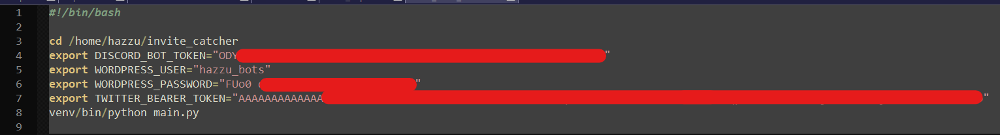

# Invite Catcher
This is a Discord bot that catches all invites posted to specified channels and then posts those invites to a WordPress site.

### How it works?
In the [main](main.py) file we started the client to connect with the discord API and we registered two events:
- `on_ready`: will fire whenever the bot starts its connection with Discord API.
- `on_message`: will be triggered whenever a new message is sent on channels that the bot has access to.

For every new incoming message that comes from a channel specified in [channel_ids](channel_ids.txt) the bot will look for invites from discord servers through the module [catch_and_post](catch_and_post.py). When found, the bot will create a new post on the WordPress site to publicize the invitation, which contains a description (message content), invitation server icon and a table containing publication data.

If there is already a post for invitations from that server, the bot will simply add this new one to the end of the post. The bot will be able to find posts for a certain server by looking for its `id`, since when creating a post the bot intentionally adds a html comment containing the `guild_id`. If the found invitation has already been posted, it will be ignored.

### How to run the bot
First make sure you are using python 3.8 or higher. Then install the [requirements](requirements.txt) with `pip`.
You will need to set the environment variables:
```bash
export DISCORD_BOT_TOKEN=""
export WORDPRESS_USER=""
export WORDPRESS_PASSWORD=""
```
Finally, run the [main](main.py) file:
```bash
python main.py
```

### Setting it on DreamHost
To run this bot on DreamHost (the platform used by the client) I deployed the application using SSH and Git and then configured the python environment on the machine. All files referring to the bot are located at the address `/home/hazzu/invit_catcher`.

To run it I created a bash script `run_bot.sh` where I set the environment variables and call [main](main.py). That way I can run the bot automatically from a Cron Job:



### Configuring expected channels
To control which channels will be expected by the bot to capture messages, you can use the following commands. Use them in a channel that the bot can send messages to, such as the direct message channel. 